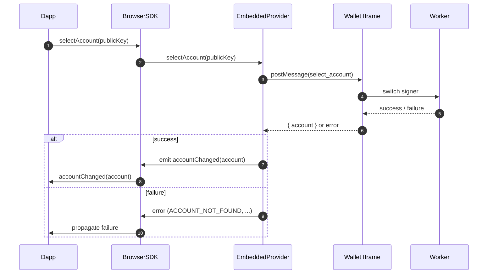

## Account Selection Flow

**Notes**

- If the wallet cannot locate the requested public key, it responds with an `ACCOUNT_NOT_FOUND` error and leaves the current selection unchanged.
- Successful selections are broadcast via the `accountChanged` event so every consumer stays in sync without polling.
