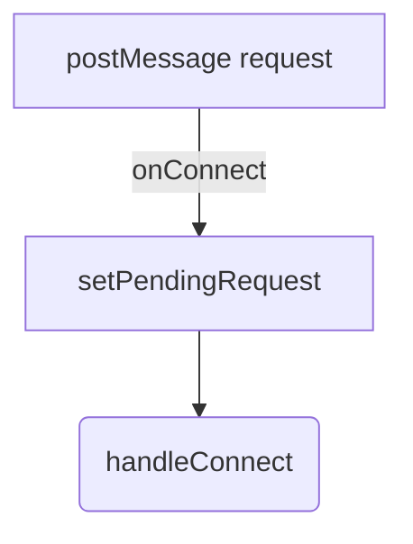
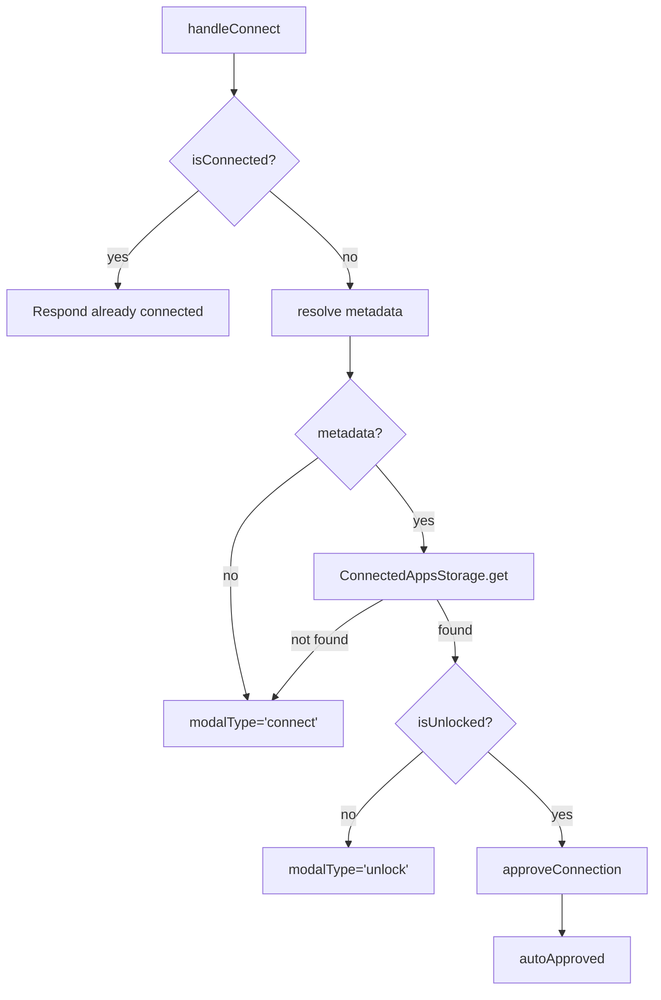
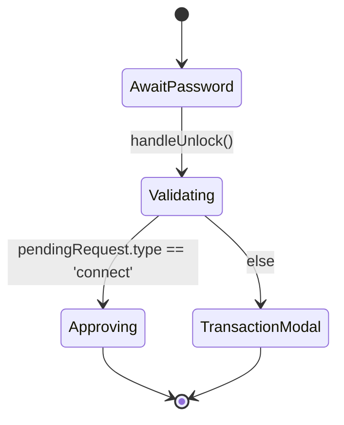

# Embedded Flow Data Diagram

## 1. Message Arrival (`useEmbeddedMessageHandlers`)

- `setPendingRequest` captures the raw request data; metadata is not set yet.
- `handleConnect` receives the original MessageEvent to derive metadata.

## 2. Connection Flow (`useConnectionFlow`)

During `approveConnection`:
- Loads account list (`accounts` or fallback to IndexedDB)
- Upserts metadata (`ConnectedAppsStorage.upsert`)
- Updates state (modal closed, `isConnected=true`, `appMetadata` stored)
- Sends `CONNECT` event/response

## 3. Unlock Flow (`useUnlockFlow`)

- `handleUnlock` checks `pendingRequest`.
- For connect requests, calls `approveConnection({ skipUnlockCheck: true })`.
- For others, sets `modalType='approve-transaction'`.

## 4. Transaction Flow (`useTransactionFlow`)

- `handleSignTransaction`
  - If disconnected: respond locked.
  - If locked: `modalType='unlock'`, else `modalType='approve-transaction'`.
- `handleApproveTransaction`
  - Signs via worker.
  - Sends response, clears `pendingRequest`/modal state.

## 5. Provider/Context Orchestration (`EmbeddedFlowContext`)

- Holds shared state: `modalType`, `pendingRequest`, `appMetadata`, loading/error flags.
- Handles worker auto-lock via effect: resets state, logs `LOCK` event.
- Renders modals based on `modalType` with sanitized metadata.

## Variables & Data Ownership

| Variable | Owner (hook/context) | Notes |
|----------|----------------------|-------|
| `pendingRequest` | `useConnectionFlow` | Set by message handlers, read throughout flows |
| `appMetadata` | `useConnectionFlow` | Derived in `handleConnect`, used in UI & persistence |
| `modalType` | `useConnectionFlow` | Controls which modal view to render |
| `isConnected` | `useConnectionFlow` | Tracks connection state for current request |
| `password` | `useUnlockFlow` | Local to unlock modal |
| `ConnectedAppsStorage` | connection flow | Upsert + get on approval/auto-approval |

## Data Flow Summary
1. Message handlers normalize incoming requests, cache them in state, and delegate to flow hooks.
2. Connection flow resolves metadata, decides modal vs. auto-approval, persists state, and emits events.
3. Unlock flow handles password entry and re-invokes connection logic or transaction approval.
4. Transaction flow manages sign operations and responses.
5. EmbeddedFlowProvider coordinates these hooks, handles global side effects (auto-lock), and renders the appropriate modal or idle UI.
